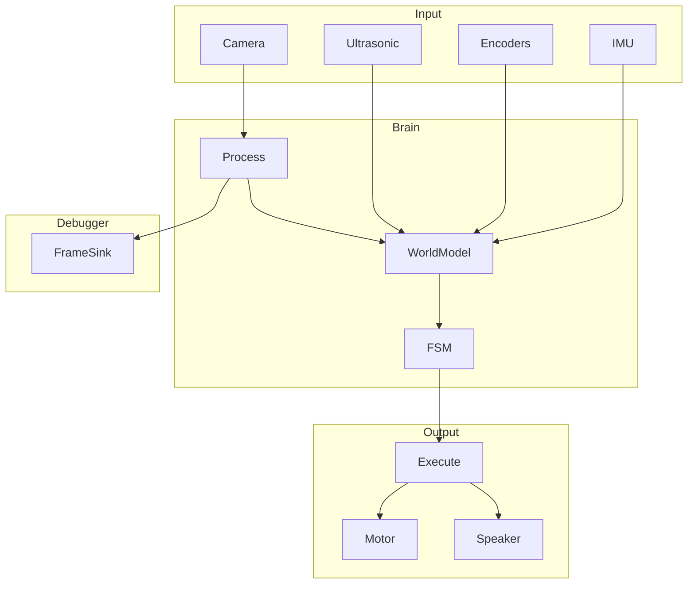
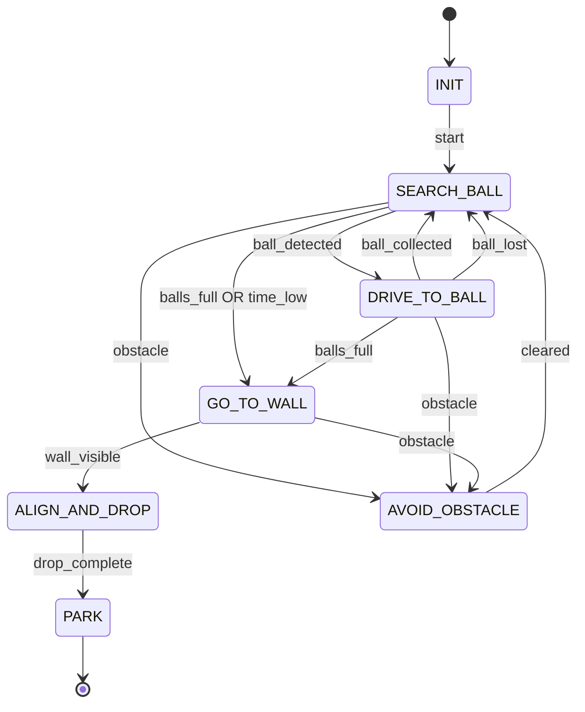

# UniBots Design

## Process loop

The main loop in [brain/main.py](brain/main.py) runs at full rate:

```
1. Create sensors (camera_front, camera_rear, ultrasonic, encoders, imu)
2. Create actuators (motor, speaker) and frame_sink (debug)
3. init() all; frame_sink.start()
4. Loop:
   - front_frame = camera_front.get_data()
   - rear_frame = camera_rear.get_data()
   - distance = ultrasonic.get_data()
   - left, right = encoders.get_data()
   - heading = imu.get_data() if imu else None
   - annotated = process(front_frame)     # YOLO + path
   - frame_sink.send(annotated)           # debug display
   - (FSM will drive motor, speaker when wired)
5. finally: stop/close all
```

Sensors feed into Process (YOLO); annotated frames go to debugger. Motor and speaker are ready for FSM control.

---

## Codebase structure

```
src/
  brain/           # Control logic
    main.py        # Entry point: wire sensors → process → debug
    config.py      # Load config.yaml
    process.py     # YOLO + path annotations (pure logic)
    fsm.py         # State machine skeleton (to be wired)

  input/           # Sensors (sim/real per folder)
    base.py        # Sensor ABC: init(), get_data(), stop()
    camera/        # create_front_camera, create_rear_camera
    ultrasonic/    # create_ultrasonic
    encoders/      # create_encoders
    imu/           # create_imu

  output/          # Actuators (sim/real per folder)
    base.py        # Actuator ABC: init(), stop()
    motor_controller/  # create_motor_controller, drive()
    speaker/       # create_speaker, beep()

  debugger/        # Debug frame viewing
    base.py        # FrameSink ABC
    tcp.py         # TCP stream (headless)
    local.py       # OpenCV window
    viewer.py      # Client to connect to TCP stream

  config.yaml      # input_mode, actuator_mode, etc.
```

Sensors and actuators use creators that branch on `INPUT_MODE` / `ACTUATOR_MODE` internally; main never branches on config.

### Data flow

1. All inputs (including camera) feed into the brain.
2. Brain updates world model, FSM state, and produces a decision (command).
3. Output executes the command on hardware.



---

## Core behavior (locked-in assumptions)

* Intake always ON
* Ball collection is **drive-through**
* Robot collects continuously
* **Exactly one** drop-off
* After drop → park → stop forever

---

## FSM States

```
INIT
SEARCH_BALL
DRIVE_TO_BALL
GO_TO_WALL
ALIGN_AND_DROP
PARK
AVOID_OBSTACLE
```

---

## State Responsibilities (high level)

### INIT

* Wait for physical start
* Reset ball counter and timers
* Enable intake

---

### SEARCH_BALL

* Wander / sweep arena
* Look for balls using front camera

**Transitions**

* Ball detected → `DRIVE_TO_BALL`
* Balls full OR time low → `GO_TO_WALL`

---

### DRIVE_TO_BALL

* Face detected ball
* Drive forward so ball rolls into intake
* Maintain heading with IMU
* Intake always ON

**Transitions**

* Ball collected (counter increments) → `SEARCH_BALL`
* Ball lost → `SEARCH_BALL`
* Balls full → `GO_TO_WALL`

---

### GO_TO_WALL

* Rotate toward own wall using IMU heading
* Drive forward continuously
* Avoid obstacles reactively
* Use AprilTag opportunistically for orientation correction

**Transition**

* Wall / net visible → `ALIGN_AND_DROP`

---

### ALIGN_AND_DROP

* Switch to rear camera
* Align parallel to wall
* Stop
* Drop all balls

**Transition**

* Drop complete → `PARK`

---

### PARK

* Drive slowly until touching wall
* Stop permanently

Terminal state.

---

### AVOID_OBSTACLE (interrupt-style)

* Triggered from any motion state
* Local turn + short move
* Resume previous state

---

## Main Control Loop (Skeleton)

```
loop @ fixed rate:

  read sensors
  update IMU heading
  update encoder-based motion
  update ball counter
  update time remaining

  if ultrasonic detects obstacle:
    run AVOID_OBSTACLE
    continue

  switch FSM state:

    SEARCH_BALL:
      if ball_detected:
        state = DRIVE_TO_BALL
      else:
        wander()

      if balls_full or time_low:
        state = GO_TO_WALL

    DRIVE_TO_BALL:
      drive_toward_ball()

      if ball_collected or ball_lost:
        state = SEARCH_BALL

      if balls_full:
        state = GO_TO_WALL

    GO_TO_WALL:
      orient_toward_wall()
      drive_forward()

      if wall_visible:
        state = ALIGN_AND_DROP

    ALIGN_AND_DROP:
      align_with_wall()
      drop_balls()
      state = PARK

    PARK:
      drive_forward_slow()
      stop_forever()
```

---

## Final FSM Diagram (Mermaid)


